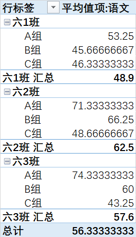
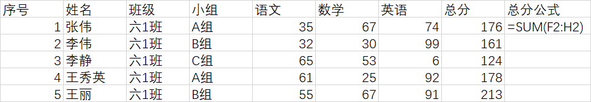

## 读入测试数据

```{r}
require(readxl)

# 载入xlsx数据
chengjibiao <- read_xlsx("r4excel-data.xlsx")

# 转化成数据框格式
#chengjibiao <- as.data.frame(chengjibiao)

# 查看数据结构
str(chengjibiao)
chengjibiao

```


## 分类汇总

### 分别对3个班的3个小组进行计算平均分

excel用数据透视表实现如下效果：





下面用R实现这一类似功能

```{r}
# 计算3个班各科的平均分
aggregate(chengjibiao[,c("语文","数学","英语")],by = list(小组 = chengjibiao$小组,班级 = chengjibiao$班级) , mean)

# 计算六1班的语文平均分
sapply(subset(chengjibiao,班级 == "六1班",select = c("语文")),mean)
```

### 对每个学生进行总分计算

excel通过公式对每个学生进行总分计算



R中实现方法1：

```{r}
chengjibiao$总分 <- rowSums(chengjibiao[,c(5:7)])
```


R中实现方法2：

```{r}
require(dplyr)
mutate(chengjibiao, 总分2 = c(5:7))

```
